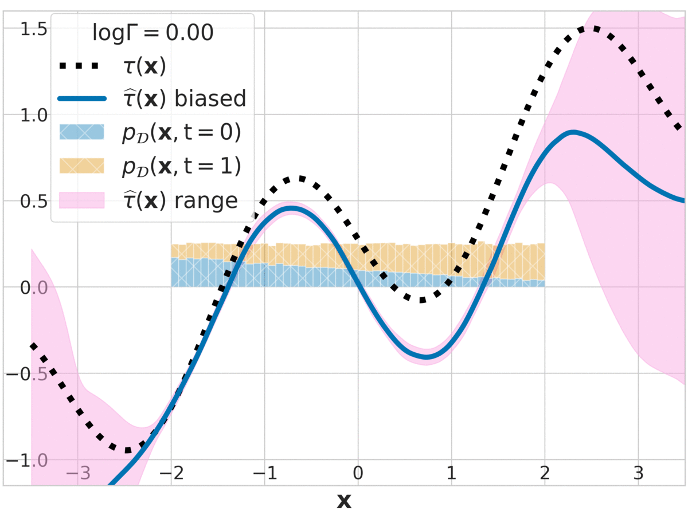

# quince

Code for [Quantifying Ignorance in Individual-Level Causal-Effect Estimates under Hidden Confounding](https://arxiv.org/abs/2103.04850)



## Installation

```.bash
$ git clone git@github.com:anndvision/quince.git
$ cd quince
$ conda env create -f environment.yml
$ conda activate quince
```

## Example: Replicating IHDP results

### Step 1: Hyperparameter Tuning (optional)

Find the best hyperparameters using the `tune` function, on a dataset like `ihdp` for a `density-network` model.

```.bash
$ quince \
    tune \
        --job-dir ~/experiments/quince/tuning/ \
        --max-samples 200 \
        --gpu-per-trial 0.25 \
    ihdp \
        --root /path/to/quince-repo/assets/ \
    density-network
```

### Step 2: Train ensembles over a number of trials

Here, we use the `train` function to fit an ensemble of `density-network`s on 200 realizations of the `ihdp` with hidden confounding dataset.

```.bash
$ quince \
    train \
        --job-dir ~/experiments/quince/ \
        --num-trials 200 \
        --gpu-per-trial 0.25 \
    ihdp \
        --root assets/ \
    density-network \
        --dim-hidden 400 \
        --num-components 5 \
        --depth 3 \
        --negative-slope -1 \
        --dropout-rate 0.15 \
        --spectral-norm 0.95 \
        --learning-rate 1e-3 \
        --batch-size 32 \
        --epochs 500 \
        --ensemble-size 10

```

### Step 3: Evaluate

```.bash
$ quince \
    evaluate \
        --experiment-dir ~/experiments/quince/ihdp/hc-True_beta-None/density-network/dh-400_nc-5_dp-3_ns--1.0_dr-0.15_sn-0.95_lr-0.001_bs-32_ep-500/ \
        --mc-samples 100 \
```

## Replicating Other Results

### Simulated Data

```.bash
$ quince \
    train \
        --job-dir ~/experiments/quince/ \
        --num-trials 20 \
        --gpu-per-trial 0.25 \
    synthetic \
        --lambda-star 1.65
    density-network \
        --dim-hidden 100 \
        --num-components 5 \
        --depth 4 \
        --negative-slope 0.0 \
        --dropout-rate 0.0 \
        --spectral-norm 12.0 \
        --learning-rate 1e-3 \
        --batch-size 32 \
        --epochs 500 \
        --ensemble-size 10

```

```.bash
$ quince \
    evaluate \
        --experiment-dir ~/experiments/quince/synthetic/ne-1000_ls-1.65_ga-4.00_be-0.75_si-1.00_dl-2.00/density-network/dh-100_nc-5_dp-4_ns-0.0_dr-0.0_sn-12.0_lr-0.001_bs-32_ep-500/ \
        --mc-samples 100 \
```

Repeat the above for `--lambda-star 2.72` and `--lambda-star 4.48`.

### HCMNIST

```.bash
$ quince \
    train \
        --job-dir ~/experiments/quince/ \
        --num-trials 20 \
        --gpu-per-trial 0.25 \
    hcmnist \
        --root ~/data
        --lambda-star 1.65
    density-network \
        --dim-hidden 100 \
        --num-components 5 \
        --depth 3 \
        --negative-slope 0.0 \
        --dropout-rate 0.1 \
        --spectral-norm 24.0 \
        --learning-rate 2e-4 \
        --batch-size 100 \
        --epochs 500 \
        --ensemble-size 5

```

```.bash
$ quince \
    evaluate \
        --experiment-dir ~/experiments/quince/hcmnist/ls-1.65_ga-4.00_be-0.75_si-1.00_dl-2.00/density-network/dh-100_nc-5_dp-3_ns-0.0_dr-0.1_sn-24.0_lr-0.0002_bs-100_ep-500/ \
        --mc-samples 100 \
```

Repeat the above for `--lambda-star 2.72` and `--lambda-star 4.48`.
